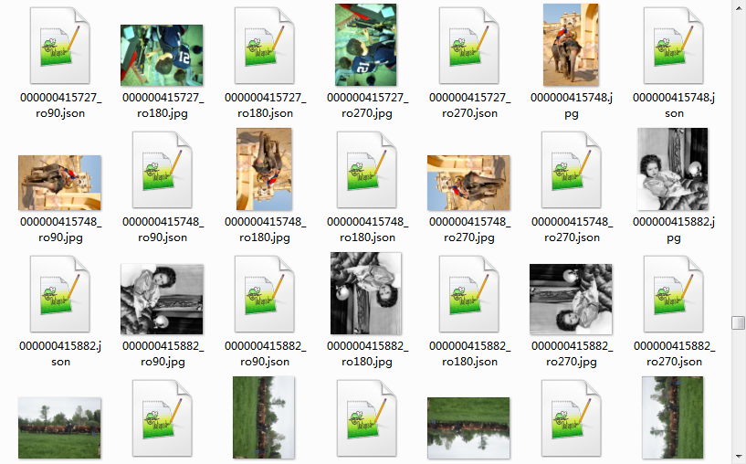
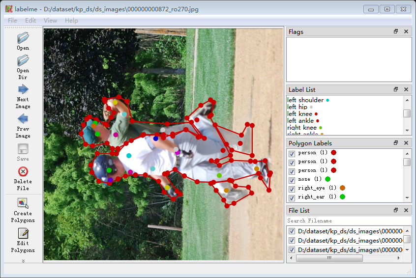

============================================
# 1 single_json2yolo.py

单个json文件转为yolo txt格式

目前仅仅支持　labelme rectangle　标注方式转换

## 依赖
pip install glob

## 运行
python single_json2yolo.py --load_json_path=json标签目录 --save_path=输出目录 --names_file=标签名列表文件

标签名列表文件 label_names.txt
~~~txt
person
vehicle
~~~

============================================
# 2 label_kp2coco.py

将labelme 标注的关键点数据集 json 合并

## 依赖 

pip install glob pycocotools datetime

## 运行

python label_kp2coco.py --load_json_path=待处理json标签文件存放路径 --save_path=合并后json文件名 --kp_names_file=关键点标签名列表 --names_file=类别标签列表


关键点名列表文件 key_point_names.txt (注意顺序很重要 影响 骨骼连接关系 按照coco顺序排列)
~~~txt
nose
left_eye
right_eye
left_ear
right_ear
left_shoulder
right_shoulder
left_elbow
right_elbow
left_wrist
right_wrist
left_hip
right_hip
left_knee
right_knee
left_ankle
right_ankle
~~~

============================================
# 3 kp_datastrong.py

关键点数据增强工具 将图片和标签 旋转90° 180° 270° 保持同步 (以验证OK)

１　coco_json_split.py  用于分解 coco大　json格式

２　采用kp_datastong.py 数据增强

３　采用json 合并工具　将单独　json 数据合并

标签查看可用 labelme 工具查看

https://github.com/wkentaro/labelme

4 查看方法 将标签文件和图片放在一个文件夹内



labelme 查看



============================================
# 4 judge_json_label.py
json标注文件检查工具
- 验证标签内文件名是否一致 删除路径信息 启用该功能后 图片和标签必须放在同一目录下
- 根据 **--label_corr_names** 根据列表更改标签名
- 根据 **--check_label_names** 文件检查标签名是否合法
- **--judeg_groupid** 是否启用group ID检查
- **--judeg_label_only** 在启用 judeg_groupid 选项后检查标签是否唯一

```shell
# python judge_json_label.py --input_annotation_path=图片和标签目录 --check_label_names=标签名列表文件 --judeg_filename 启用文件名检查 --judeg_groupid 启用group ID标注检查 --judeg_label_only 启用标签唯一性检查
$ python judge_json_label.py --input_annotation_path=/home/fisun/dataset/private/fall/kp --check_label_names=/home/fisun/dataset/private/fall/kp_label_names.txt --judeg_filename --judeg_groupid --judeg_label_only
```

- label_corr_names 根据列表更改标签名 文件举例
- 如果需要将 fall标签更改为person 该文件写法 
```txt
fall person
```

- check_label_names 合法标签名列表
- 根据文件中标签列表进行检查 如果发现json文件内标签名不再列表中，就将该文件打印出来

```txt
person
fall
nose
left_eye
right_eye
left_ear
right_ear
left_shoulder
right_shoulder
left_elbow
right_elbow
left_wrist
right_wrist
left_hip
right_hip
left_knee
right_knee
left_ankle
right_ankle
```

```log
Error label gf /home/fisun/dataset/private/fall/kp
```

- 运行效果如下

```log
corr names file not exit  
  0%|                                                                                                                                                                                                | 0/866 [00:00<?, ?it/s]group ID is None right_wrist /home/fisun/dataset/private/fall/kp/videooutput82020-12-24__20_33_28_95.json
  3%|█████▋                                                                                                                                                                                 | 27/866 [00:11<05:59,  2.33it/s]group ID is None left_shoulder /home/fisun/dataset/private/fall/kp/videooutput2020-12-24__20_07_26_56.json
group ID is None right_shoulder /home/fisun/dataset/private/fall/kp/videooutput2020-12-24__20_07_26_56.json
group ID is None right_ear /home/fisun/dataset/private/fall/kp/videooutput2020-12-24__20_07_26_56.json
group ID is None right_hip /home/fisun/dataset/private/fall/kp/videooutput2020-12-24__20_07_26_56.json
(tools-36) fisun@fisun-System-Product-Name:~/work/python/annotation_tools$  cd /home/fisun/work/python/annotation_tools ; /usr/bin/env /home/fisun/anaconda2/envs/tools-36/bin/python /home/fisun/.vscode-server/extensions/ms-python.python-2020.12.424452561/pythonFiles/lib/python/debugpy/launcher 33423 -- /home/fisun/work/python/annotation_tools/judge_json_label.py 
corr names file not exit  
  0%|                                                                                                                                                                                                | 0/866 [00:00<?, ?it/s]  0%|▏                                                                                                                                                                                     | 1/866 [00:27<6:43:30, 27.99s/it]label group ID overlap left_hip 1 /home/fisun/dataset/private/fall/kp/2020-12-26__09_42_31_462.json
label group ID overlap right_ankle 1 /home/fisun/dataset/private/fall/kp/2020-12-26__09_42_31_462.json
  0%|▍                                                                                                                                                                                     | 2/866 [00:46<6:02:02, 25.14s/it]label group ID overlap right_ankle 1 /home/fisun/dataset/private/fall/kp/videooutput2020-12-24__20_09_06_7.json
label group ID overlap left_shoulder 1 /home/fisun/dataset/private/fall/kp/2020-12-26__09_45_21_525.json
label group ID overlap right_ear 2 /home/fisun/dataset/private/fall/kp/2020-12-26__09_45_21_525.json
label group ID overlap right_eye 1 /home/fisun/dataset/private/fall/kp/2020-12-26__10_14_14_11.json
group ID is None right_wrist /home/fisun/dataset/private/fall/kp/videooutput82020-12-24__20_33_28_95.json
group ID is None left_shoulder /home/fisun/dataset/private/fall/kp/videooutput2020-12-24__20_07_26_56.json
group ID is None right_shoulder /home/fisun/dataset/private/fall/kp/videooutput2020-12-24__20_07_26_56.json
group ID is None right_ear /home/fisun/dataset/private/fall/kp/videooutput2020-12-24__20_07_26_56.json
group ID is None right_hip /home/fisun/dataset/private/fall/kp/videooutput2020-12-24__20_07_26_56.json
label group ID overlap right_wrist 1 /home/fisun/dataset/private/fall/kp/2020-12-26__09_43_34_581.json
label group ID overlap right_wrist 1 /home/fisun/dataset/private/fall/kp/videooutput2020-12-24__20_04_35_104.json
label group ID overlap left_wrist 1 /home/fisun/dataset/private/fall/kp/2020-12-26__10_11_38_37.json
label group ID overlap right_wrist 1 /home/fisun/dataset/private/fall/kp/2020-12-26__10_11_38_37.json
label group ID overlap right_shoulder 1 /home/fisun/dataset/private/fall/kp/videooutput2020-12-24__20_04_35_129.json
label group ID overlap left_wrist 1 /home/fisun/dataset/private/fall/kp/2020-12-26__10_12_46_140.json
label group ID overlap right_ear 1 /home/fisun/dataset/private/fall/kp/videooutput2020-12-24__20_08_11_236.json
label group ID overlap left_knee 1 /home/fisun/dataset/private/fall/kp/videooutput2020-12-24__20_08_11_236.json
label group ID overlap right_wrist 1 /home/fisun/dataset/private/fall/kp/videooutput2020-12-24__20_08_11_236.json
label group ID overlap right_elbow 1 /home/fisun/dataset/private/fall/kp/videooutput82020-12-24__20_33_12_184.json
group ID is None right_elbow /home/fisun/dataset/private/fall/kp/videooutput82020-12-24__20_18_10_251.json
group ID is None left_hip /home/fisun/dataset/private/fall/kp/videooutput2020-12-24__20_08_39_37.json
group ID is None left_hip /home/fisun/dataset/private/fall/kp/videooutput2020-12-24__20_07_26_413.json
group ID is None right_knee /home/fisun/dataset/private/fall/kp/videooutput2020-12-24__20_07_26_413.json
label group ID overlap left_ankle 1 /home/fisun/dataset/private/fall/kp/videooutput2020-12-24__20_07_26_413.json
group ID is None right_shoulder /home/fisun/dataset/private/fall/kp/2020-12-26__10_09_54_367.json
group ID is None left_ear /home/fisun/dataset/private/fall/kp/videooutput2020-12-24__20_07_26_445.json
Error label left_wrisy /home/fisun/dataset/private/fall/kp/videooutput2020-12-24__20_08_11_138.json
label group ID overlap right_hip 1 /home/fisun/dataset/private/fall/kp/videooutput2020-12-24__20_08_11_138.json
group ID is None right_wrist /home/fisun/dataset/private/fall/kp/2020-12-26__09_43_34_55.json
group ID is None left_hip /home/fisun/dataset/private/fall/kp/2020-12-26__09_43_34_55.json
group ID is None right_hip /home/fisun/dataset/private/fall/kp/2020-12-26__09_43_34_55.json
group ID is None left_knee /home/fisun/dataset/private/fall/kp/2020-12-26__09_43_34_55.json
group ID is None right_knee /home/fisun/dataset/private/fall/kp/2020-12-26__09_43_34_55.json
group ID is None left_ankle /home/fisun/dataset/private/fall/kp/2020-12-26__09_43_34_55.json
group ID is None person /home/fisun/dataset/private/fall/kp/2020-12-26__09_43_34_55.json
label group ID overlap left_ear 1 /home/fisun/dataset/private/fall/kp/2020-12-26__09_43_34_55.json
group ID is None nose /home/fisun/dataset/private/fall/kp/videooutput82020-12-24__20_26_52_63.json
group ID is None nose /home/fisun/dataset/private/fall/kp/videooutput82020-12-24__20_32_55_5.json
label group ID overlap right_shoulder 1 /home/fisun/dataset/private/fall/kp/videooutput82020-12-24__20_32_02_254.json
group ID is None right_elbow /home/fisun/dataset/private/fall/kp/videooutput2020-12-24__20_08_11_179.json
group ID is None right_knee /home/fisun/dataset/private/fall/kp/videooutput2020-12-24__20_08_11_179.json
group ID is None right_hip /home/fisun/dataset/private/fall/kp/videooutput82020-12-24__20_33_28_264.json
label group ID overlap right_wrist 1 /home/fisun/dataset/private/fall/kp/videooutput2020-12-24__20_06_58_386.json
label group ID overlap right_knee 1 /home/fisun/dataset/private/fall/kp/videooutput82020-12-24__20_35_12_97.json
label group ID overlap right_shoulder 1 /home/fisun/dataset/private/fall/kp/videooutput2020-12-24__20_05_38_111.json
group ID is None fall /home/fisun/dataset/private/fall/kp/videooutput82020-12-24__20_27_40_260.json
label group ID overlap right_hip 1 /home/fisun/dataset/private/fall/kp/videooutput2020-12-24__20_08_11_127.json
label group ID overlap right_wrist 1 /home/fisun/dataset/private/fall/kp/videooutput2020-12-24__20_05_38_564.json
label group ID overlap right_wrist 1 /home/fisun/dataset/private/fall/kp/videooutput2020-12-24__20_05_38_564.json
label group ID overlap right_wrist 1 /home/fisun/dataset/private/fall/kp/videooutput82020-12-24__20_28_56_93.json
label group ID overlap right_shoulder 1 /home/fisun/dataset/private/fall/kp/videooutput82020-12-24__20_35_30_219.json
group ID is None left_wrist /home/fisun/dataset/private/fall/kp/videooutput2020-12-24__20_08_11_53.json
Error label gf /home/fisun/dataset/private/fall/kp/videooutput2020-12-24__20_09_58_250.json
group ID is None gf /home/fisun/dataset/private/fall/kp/videooutput2020-12-24__20_09_58_250.json
label group ID overlap right_elbow 1 /home/fisun/dataset/private/fall/kp/videooutput2020-12-24__20_09_58_250.json
group ID is None left_ear /home/fisun/dataset/private/fall/kp/2020-12-26__10_15_14_0.json
label group ID overlap right_wrist 1 /home/fisun/dataset/private/fall/kp/2020-12-26__10_15_14_0.json
label group ID overlap left_hip 1 /home/fisun/dataset/private/fall/kp/2020-12-26__10_11_38_238.json
group ID is None right_hip /home/fisun/dataset/private/fall/kp/videooutput82020-12-24__20_31_21_325.json
group ID is None person /home/fisun/dataset/private/fall/kp/2020-12-26__09_42_31_17.json
group ID is None right_ear /home/fisun/dataset/private/fall/kp/2020-12-26__09_42_31_17.json
group ID is None right_shoulder /home/fisun/dataset/private/fall/kp/2020-12-26__09_42_31_17.json
group ID is None right_elbow /home/fisun/dataset/private/fall/kp/2020-12-26__09_42_31_17.json
group ID is None right_wrist /home/fisun/dataset/private/fall/kp/2020-12-26__09_42_31_17.json
group ID is None right_hip /home/fisun/dataset/private/fall/kp/2020-12-26__09_42_31_17.json
group ID is None right_knee /home/fisun/dataset/private/fall/kp/2020-12-26__09_42_31_17.json
group ID is None right_ankle /home/fisun/dataset/private/fall/kp/2020-12-26__09_42_31_17.json
group ID is None left_shoulder /home/fisun/dataset/private/fall/kp/2020-12-26__09_42_31_17.json
group ID is None left_elbow /home/fisun/dataset/private/fall/kp/2020-12-26__09_42_31_17.json
group ID is None left_wrist /home/fisun/dataset/private/fall/kp/2020-12-26__09_42_31_17.json
group ID is None left_hip /home/fisun/dataset/private/fall/kp/2020-12-26__09_42_31_17.json
group ID is None left_knee /home/fisun/dataset/private/fall/kp/2020-12-26__09_42_31_17.json
group ID is None left_ankle /home/fisun/dataset/private/fall/kp/2020-12-26__09_42_31_17.json
group ID is None right_ear /home/fisun/dataset/private/fall/kp/videooutput2020-12-24__20_08_11_187.json
group ID is None right_hip /home/fisun/dataset/private/fall/kp/videooutput82020-12-24__20_29_40_8.json
label group ID overlap right_wrist 1 /home/fisun/dataset/private/fall/kp/videooutput82020-12-24__20_28_56_83.json
label group ID overlap right_shoulder 1 /home/fisun/dataset/private/fall/kp/videooutput82020-12-24__20_35_30_218.json
label group ID overlap right_hip 1 /home/fisun/dataset/private/fall/kp/2020-12-26__10_15_32_32.json
label group ID overlap left_wrist 1 /home/fisun/dataset/private/fall/kp/2020-12-26__10_12_46_0.json
group ID is None right_eye /home/fisun/dataset/private/fall/kp/videooutput82020-12-24__20_25_56_110.json
group ID is None right_hip /home/fisun/dataset/private/fall/kp/videooutput2020-12-24__20_08_11_38.json
group ID is None right_elbow /home/fisun/dataset/private/fall/kp/videooutput2020-12-24__20_09_58_319.json
label group ID overlap right_wrist 1 /home/fisun/dataset/private/fall/kp/videooutput2020-12-24__20_09_58_319.json
label group ID overlap right_shoulder 1 /home/fisun/dataset/private/fall/kp/videooutput82020-12-24__20_31_21_215.json
label group ID overlap right_ear 1 /home/fisun/dataset/private/fall/kp/2020-12-26__10_12_46_15.json
label group ID overlap left_eye 1 /home/fisun/dataset/private/fall/kp/2020-12-26__10_12_46_15.json
label group ID overlap left_ear 1 /home/fisun/dataset/private/fall/kp/2020-12-26__10_15_14_208.json
label group ID overlap right_knee 1 /home/fisun/dataset/private/fall/kp/videooutput82020-12-24__20_18_34_1.json
Error label left— /home/fisun/dataset/private/fall/kp/videooutput2020-12-24__20_08_11_16.json
group ID is None left_knee /home/fisun/dataset/private/fall/kp/videooutput82020-12-24__20_18_34_32.json
group ID is None left_ear /home/fisun/dataset/private/fall/kp/videooutput82020-12-24__20_33_28_159.json
group ID is None left_elbow /home/fisun/dataset/private/fall/kp/videooutput82020-12-24__20_31_21_20.json
label group ID overlap right_shoulder 1 /home/fisun/dataset/private/fall/kp/2020-12-26__10_12_46_21.json
label group ID overlap right_shoulder 1 /home/fisun/dataset/private/fall/kp/videooutput82020-12-24__20_32_55_32.json
label group ID overlap right_shoulder 1 /home/fisun/dataset/private/fall/kp/videooutput82020-12-24__20_35_30_217.json
label group ID overlap left_ankle 1 /home/fisun/dataset/private/fall/kp/videooutput2020-12-24__20_09_06_49.json
group ID is None left_hip /home/fisun/dataset/private/fall/kp/videooutput82020-12-24__20_32_02_129.json
label group ID overlap right_shoulder 1 /home/fisun/dataset/private/fall/kp/2020-12-26__10_13_04_16.json
label group ID overlap right_hip 1 /home/fisun/dataset/private/fall/kp/2020-12-26__10_15_32_116.json
label group ID overlap right_hip 1 /home/fisun/dataset/private/fall/kp/videooutput2020-12-24__20_06_58_31.json
label group ID overlap right_elbow 1 /home/fisun/dataset/private/fall/kp/videooutput82020-12-24__20_35_12_87.json
group ID is None left_ankle /home/fisun/dataset/private/fall/kp/videooutput82020-12-24__20_29_19_194.json
group ID is None left_eye /home/fisun/dataset/private/fall/kp/2020-12-26__10_00_17_340.json
group ID is None right_wrist /home/fisun/dataset/private/fall/kp/videooutput82020-12-24__20_26_16_271.json
label group ID overlap left_wrist 1 /home/fisun/dataset/private/fall/kp/videooutput82020-12-24__20_26_16_271.json
 65%|█████████████████████████████████████████████████████████████████████████████████████████████████████████████████████▍                                                              | 565/866 [00:46<1:28:17, 17.60s/it]group ID is None right_knee /home/fisun/dataset/private/fall/kp/videooutput2020-12-24__20_08_39_332.json
label group ID overlap right_shoulder 1 /home/fisun/dataset/private/fall/kp/videooutput82020-12-24__20_35_30_224.json
label group ID overlap left_wrist 1 /home/fisun/dataset/private/fall/kp/2020-12-26__10_15_48_13.json
label group ID overlap left_elbow 1 /home/fisun/dataset/private/fall/kp/videooutput82020-12-24__20_34_54_193.json
label group ID overlap left_elbow 1 /home/fisun/dataset/private/fall/kp/videooutput2020-12-24__20_05_38_508.json
group ID is None left_wrist /home/fisun/dataset/private/fall/kp/2020-12-26__10_15_32_14.json
label group ID overlap right_wrist 1 /home/fisun/dataset/private/fall/kp/2020-12-26__10_15_32_14.json
group ID is None right_knee /home/fisun/dataset/private/fall/kp/videooutput82020-12-24__20_31_45_16.json
Error label left— /home/fisun/dataset/private/fall/kp/videooutput2020-12-24__20_09_06_133.json
group ID is None left— /home/fisun/dataset/private/fall/kp/videooutput2020-12-24__20_09_06_133.json
group ID is None left_knee /home/fisun/dataset/private/fall/kp/videooutput2020-12-24__20_09_06_133.json
group ID is None fall /home/fisun/dataset/private/fall/kp/videooutput82020-12-24__20_18_10_170.json
label group ID overlap right_knee 1 /home/fisun/dataset/private/fall/kp/videooutput82020-12-24__20_18_10_183.json
group ID is None left_shoulder /home/fisun/dataset/private/fall/kp/videooutput82020-12-24__20_32_02_41.json
group ID is None left_elbow /home/fisun/dataset/private/fall/kp/videooutput82020-12-24__20_32_02_41.json
group ID is None left_knee /home/fisun/dataset/private/fall/kp/videooutput82020-12-24__20_35_46_41.json
group ID is None right_wrist /home/fisun/dataset/private/fall/kp/videooutput82020-12-24__20_18_34_14.json
group ID is None left_hip /home/fisun/dataset/private/fall/kp/videooutput82020-12-24__20_18_34_14.json
label group ID overlap right_ear 1 /home/fisun/dataset/private/fall/kp/videooutput82020-12-24__20_18_10_260.json
label group ID overlap right_hip 1 /home/fisun/dataset/private/fall/kp/videooutput82020-12-24__20_18_10_260.json
label group ID overlap right_shoulder 1 /home/fisun/dataset/private/fall/kp/2020-12-26__10_06_48_151.json
label group ID overlap left_shoulder 1 /home/fisun/dataset/private/fall/kp/2020-12-26__10_06_48_151.json
label group ID overlap left_elbow 1 /home/fisun/dataset/private/fall/kp/2020-12-26__10_06_48_151.json
label group ID overlap left_wrist 1 /home/fisun/dataset/private/fall/kp/2020-12-26__10_06_48_151.json
group ID is None right_shoulder /home/fisun/dataset/private/fall/kp/videooutput82020-12-24__20_32_20_205.json
group ID is None left_elbow /home/fisun/dataset/private/fall/kp/videooutput2020-12-24__20_09_58_303.json
label group ID overlap right_eye 1 /home/fisun/dataset/private/fall/kp/2020-12-26__10_11_38_291.json
label group ID overlap right_wrist 1 /home/fisun/dataset/private/fall/kp/2020-12-26__10_11_38_291.json
label group ID overlap left_wrist 1 /home/fisun/dataset/private/fall/kp/2020-12-26__10_11_38_291.json
group ID is None right_knee /home/fisun/dataset/private/fall/kp/videooutput82020-12-24__20_27_16_209.json
group ID is None left_ankle /home/fisun/dataset/private/fall/kp/2020-12-26__10_05_32_177.json
group ID is None right_shoulder /home/fisun/dataset/private/fall/kp/videooutput82020-12-24__20_28_56_261.json
label group ID overlap left_ear 1 /home/fisun/dataset/private/fall/kp/videooutput82020-12-24__20_33_47_56.json
label group ID overlap right_eye 1 /home/fisun/dataset/private/fall/kp/2020-12-26__09_42_31_563.json
label group ID overlap left_eye 1 /home/fisun/dataset/private/fall/kp/2020-12-26__09_42_31_563.json
group ID is None right_wrist /home/fisun/dataset/private/fall/kp/videooutput82020-12-24__20_18_10_77.json
label group ID overlap left_elbow 1 /home/fisun/dataset/private/fall/kp/2020-12-26__10_07_32_188.json
label group ID overlap left_shoulder 1 /home/fisun/dataset/private/fall/kp/videooutput82020-12-24__20_33_47_185.json
group ID is None left_ear /home/fisun/dataset/private/fall/kp/videooutput82020-12-24__20_16_52_43.json
label group ID overlap left_elbow 1 /home/fisun/dataset/private/fall/kp/videooutput2020-12-24__20_08_39_283.json
Error label rightleft /home/fisun/dataset/private/fall/kp/2020-12-26__10_09_54_29.json
group ID is None left_ear /home/fisun/dataset/private/fall/kp/videooutput82020-12-24__20_28_56_193.json
group ID is None right_ear /home/fisun/dataset/private/fall/kp/videooutput2020-12-24__20_07_26_117.json
group ID is None right_elbow /home/fisun/dataset/private/fall/kp/videooutput2020-12-24__20_07_26_117.json
Error label left_wrisy /home/fisun/dataset/private/fall/kp/videooutput2020-12-24__20_07_26_52.json
group ID is None left_wrisy /home/fisun/dataset/private/fall/kp/videooutput2020-12-24__20_07_26_52.json
group ID is None right_elbow /home/fisun/dataset/private/fall/kp/videooutput82020-12-24__20_18_10_16.json
label group ID overlap left_knee 1 /home/fisun/dataset/private/fall/kp/videooutput82020-12-24__20_34_54_223.json
group ID is None left_ankle /home/fisun/dataset/private/fall/kp/videooutput82020-12-24__20_26_16_278.json
group ID is None fall /home/fisun/dataset/private/fall/kp/videooutput2020-12-24__20_09_06_373.json
group ID is None left_hip /home/fisun/dataset/private/fall/kp/2020-12-26__10_13_04_351.json
label group ID overlap right_wrist 1 /home/fisun/dataset/private/fall/kp/videooutput2020-12-24__20_04_35_466.json
label group ID overlap right_knee 1 /home/fisun/dataset/private/fall/kp/2020-12-26__09_42_31_525.json
label group ID overlap left_hip 1 /home/fisun/dataset/private/fall/kp/2020-12-26__10_14_33_119.json
group ID is None right_wrist /home/fisun/dataset/private/fall/kp/videooutput2020-12-24__20_08_11_99.json
label group ID overlap right_knee 1 /home/fisun/dataset/private/fall/kp/videooutput82020-12-24__20_18_10_57.json
label group ID overlap right_ankle 1 /home/fisun/dataset/private/fall/kp/videooutput82020-12-24__20_18_10_57.json
100%|██████████████████████████████████████████████████████████████████████████████████████████████████████████████████████████████████████████████████████████████████████████████████████| 866/866 [00:46<00:00, 18.57it/s]
['person', 'right_eye', 'nose', 'right_ear', 'right_shoulder', 'right_elbow', 'right_wrist', 'right_hip', 'right_knee', 'right_ankle', 'left_eye', 'left_shoulder', 'left_elbow', 'left_wrist', 'left_hip', 'left_knee', 'left_ankle', 'fall', 'left_ear', 'left_wrisy', 'gf', 'left—', 'rightleft']

```

# 文件说明

coco_license.json   coco 许可文件

preprocess_coco_person_dataset_strong.py   coco 17点转18点


# 摔倒数据集整理

## 关键点算法数据整理

- 把图片和标签文件放在一个目录里面

- 使用工具**labelme_kp2coco.py**将单独的json合并成一个大json文件

  ```shell
  labelme_kp2coco.py --load_json_path=样本存放路径 --save_path=输出处理后的json --kp_names_file=关键点名称列表文件(列表注意顺序) --names_file=标签列表文件 --skeleton=连接关系列表文件
  ```

  

## 摔倒状态分类数据集整理

数据处理，将单个标注样本处理成分类数据集 采用**coco17_2_18classify_status.py**工具将json文件处理成fall_recognition算法训练数据

  ```shell
  coco17_2_18classify_status.py --input_json_path=标注样本存放目录 --save_path=处理后存放目录
  ```

# 异常物品&快速移动等其他算法训练数据集整理

yoloV5算法样本处理方式 采用 **single_json2yolo.py**工具将标注的json数据处理成yolo训练数据

- 把图片和标签文件放在一个目录里面

```shell
single_json2yolo.py --load_json_path=样本存放目录 --save_path=处理后输出路径
```

这里处理后输出路径最好和样本存放目录一致方便yolov5训练

